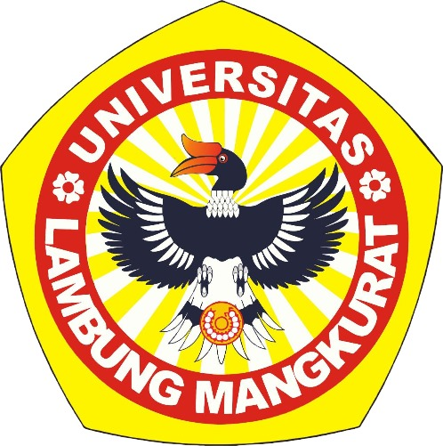
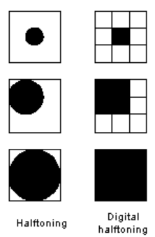
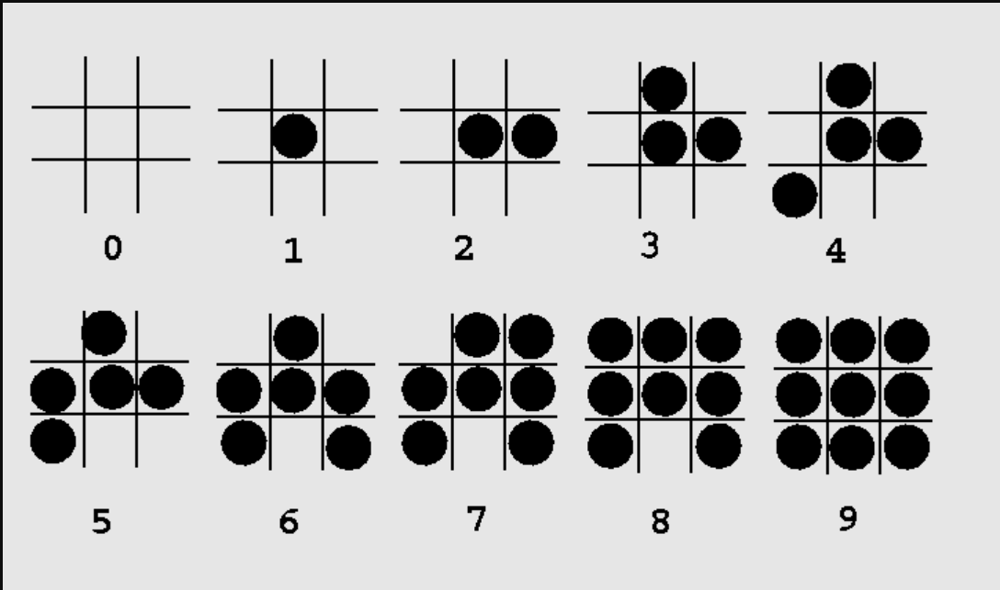
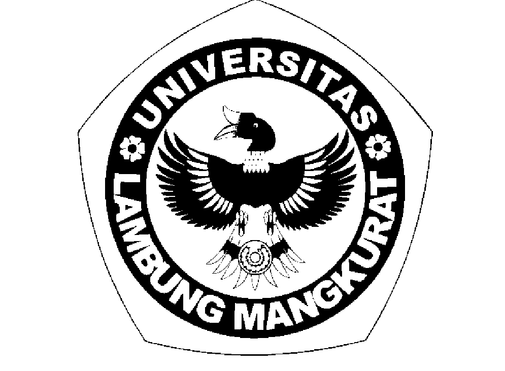
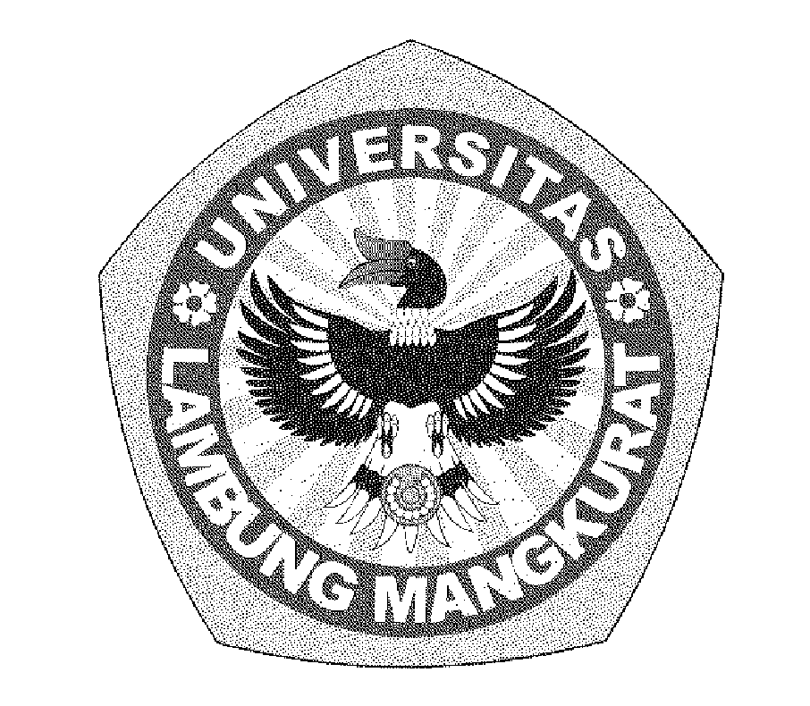

### TUGAS 3  
### PEMROSESAN CITRA DIGITAL  
### (ABKC6306)

### DISUSUN OLEH:  
Muhammad Syauqoni (2310131310007)  
### DOSEN PENGAMPU:  
Dr. Harja Santana Purba, M.Kom./Novan A.B. Saputra, S.Kom., M.T

### PROGRAM STUDI PENDIDIKAN KOMPUTER  
### FAKULTAS KEGURUAN DAN ILMU PENDIDIKAN  
### UNIVERSITAS LAMBUNG MANGKURAT  
### 2024

 
 
 
 
 
 

## Daftar Isi

- [Daftar Isi](#daftar-isi)
  - [Pendahuluan](#pendahuluan)
  - [Halftoning](#halftoning)
  - [Pattering](#pattering)
  - [contoh Program Pattering](#contoh-program-pattering)
  - [Output](#output)
  - [Dithering](#dithering)
  - [Contoh Program Dithering](#contoh-program-dithering)
  - [Output](#output-1)
  - [Daftar Pustaka](#daftar-pustaka)
  

 
 
  

### Pendahuluan
Dalam era digital saat ini, pemrosesan citra memainkan peran penting dalam berbagai aplikasi, mulai dari desain grafis hingga pengolahan gambar medis. Di antara teknik-teknik tersebut, halftoning, pattering, dan dithering muncul sebagai metode yang efektif untuk mengatasi keterbatasan dalam representasi warna dan detail gambar.

Halftoning adalah teknik yang digunakan untuk mensimulasikan gradasi warna atau tingkat abu-abu pada media yang terbatas, seperti cetakan hitam-putih. Pattering, di sisi lain, merujuk pada penciptaan pola berulang atau terstruktur dalam gambar. Sementara itu, dithering adalah metode yang digunakan untuk mengatasi masalah kuantisasi dalam pemrosesan gambar.  
  
 

### Halftoning
    Halftoning atau analog halftoning adalah proses yang mensimulasikan corak abu-abu dengan memvariasikan  
    ukuran titik-titik hitam kecil yang tersusun dalam pola yang teratur. Teknik ini digunakan dalam  
    percetakan, serta industri penerbitan. Jika Anda memeriksa foto di koran, Anda akan melihat bahwa  
    gambar tersebut tersusun dari titik-titik hitam meskipun tampak tersusun dari abu-abu. pada Gambar  
    dibawah, titik kecil yang terletak di tengah disimulasikan dalam halftoning digital dengan mengisi  
    sel halftone tengah; Demikian pula, titik berukuran sedang yang terletak di sudut kiri atas  
    disimulasikan dengan mengisi empat sel di sudut kiri atas. Titik besar yang menutupi sebagian besar  
    area pada gambar ketiga disimulasikan dengan mengisi semua sel halftone.

### Pattering
    Pattering adalah teknik halftoning yang menggunakan pola tetap (pattern) untuk menggantikan intensitas  
    skala abu-abu dengan area hitam-putih. Pola yang lebih padat digunakan untuk area gelap, sementara  
    pola yang lebih ringan digunakan untuk area terang. Teknik ini biasanya diterapkan dalam bentuk  
    grid (kotak-kotak) yang telah ditentukan sebelumnya untuk mensimulasikan tingkat kecerahan.

### contoh Program Pattering

        
        img = imread('logoULM.jpg');

        if size(img, 3) == 3
        img = rgb2gray(img);
        endif

        img = double(img);

        [rows, cols] = size(img);

        threshold = 128;
        for y = 1:rows
            for x = 1:cols
                if img(y, x) > threshold
                    img(y, x) = 255;
                else
                    img(y, x) = 0;
                endif
            endfor
        endfor

        imshow(img);  
            

### Output

 
 
 

### Dithering
    Dithering adalah metode halftoning yang menambahkan noise terkontrol ke dalam gambar untuk mensimulasikan  
    gradasi abu-abu. Metode ini lebih canggih dibandingkan pattering karena menghasilkan tampilan yang  
    lebih halus dengan mendistribusikan kesalahan kuantisasi  di antara piksel. Dengan dithering,  
    gambar hitam-putih dapat terlihat seolah-olah memiliki banyak tingkat kecerahan yang berbeda.  
    Masalah dithering yang umum terjadi adalah menghasilkan artefak pola yang diperkenalkan oleh  
    matriks thresholding tetap. Gambar berikut menunjukkan contoh operasi dithering.
      

    
    

### Contoh Program Dithering

        img = imread('logoULM.jpg');

        if size(img, 3) == 3
        img = rgb2gray(img);
        endif

        img = double(img);

        [rows, cols] = size(img);

        for y = 1:rows
            for x = 1:cols
                old_pixel = img(y, x);
                new_pixel = 0;
                if old_pixel > 128
                    new_pixel = 255;
                endif
                img(y, x) = new_pixel;
                quant_error = old_pixel - new_pixel;
                
                if x + 1 <= cols
                    img(y, x + 1) = img(y, x + 1) + quant_error * 7 / 16;
                endif
                if y + 1 <= rows && x > 1
                    img(y + 1, x - 1) = img(y + 1, x - 1) + quant_error * 3 / 16;
                endif
                if y + 1 <= rows
                    img(y + 1, x) = img(y + 1, x) + quant_error * 5 / 16;
                endif
                if y + 1 <= rows && x + 1 <= cols
                    img(y + 1, x + 1) = img(y + 1, x + 1) + quant_error * 1 / 16;
                endif
            endfor
        endfor

        img = uint8(img);

        imshow(img);

### Output

### Daftar Pustaka

[Digital Halftoning](https://people.ece.ubc.ca/irenek/techpaps/introip/manual04.html)
[Malay K. Pakhira(2011). Digital Image Processing and Pattern Recognition. Prentice-Hall of India Pvt.Limited.](https://www.google.co.id/books/edition/Digital_Image_Processing_and_Pattern_Rec/bQ4dGTfo8-sC?hl=id&gbpv=1&dq=pattering+dan+dithering&pg=PA54&printsec=frontcoverhttps://www.google.co.id/books/edition/Digital_Image_Processing_and_Pattern_Rec/bQ4dGTfo8-sC?hl=id&gbpv=1&dq=pattering+dan+dithering&pg=PA54&printsec=frontcove)  